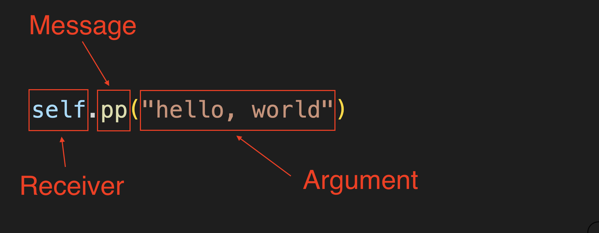

# Ruby Basics

Let us begin with a quick introduction in Ruby.

## Goal

In this lesson, you'll write your very first Ruby program, learn how Ruby "thinks" about code, and understand the building blocks you'll use in every project. We want to get you as quickly as possible to the point where you can write useful programs, and to do that we have to concentrate on the basics.

## 1. Printing to the Console

The only way to learn a new programming language is by writing programs in it. The first program to write is the same for all languages:

Print the words: "hello, world" [source](https://en.wikipedia.org/wiki/%22Hello,_World!%22_program)

In Ruby, printing output to the console is achieved using several built-in methods: `puts`, `print`, `p`, and `pp`.

```ruby
pp("hello, world")
```
{: .repl }

<aside class="tip">
  Try using the other print methods (<code>puts</code>, <code>print</code>, and <code>p</code>). Do you notice a difference in the output?
</aside>

- What does `pp` do in Ruby? <a href="https://docs.ruby-lang.org/en/master/PP.html">Ruby Docs: class PP</a>
- It pauses the program.
  - Not correct. `pp` prints data in a human-readable format.
- It prints output in a more readable way.
  - Correct! `pp` pretty-prints objects.
- It permanently stores variables.
  - Not correct. `pp` has nothing to do with saving data.
{: .choose_best #ruby_pp title="Understanding pp" answer="2"}

## 2. Variables

<!-- TODO: explain how to assign variables using `=` -->

Remember finding the value of a variables in Algebra? `100 = x + 50, Find x`

Ruby has variables too. We can store data in a variable using `=`. Let's update our hello world program to use a variable.

```ruby
greeting = "hello, world"
pp(greeting)
```
{: .repl }

Instead of retyping the string, you store it in the `greeting` variable and print it whenever you like.

<aside class="tip">
  We can be more descriptive in naming variables than just x, y, z, etc. One of the hardest things about programming is naming things well. I encourage you to be verbose and descriptive when naming things. This will make it easier to understand.
</aside>

## 3. Error Messages

Let's try to break things. Run this repl calling the `kaboom!` method.

```ruby
kaboom!
```
{: .repl }

Looks like we've triggered our first *error message*, `-e:1:in '<main>': undefined local variable or method 'kaboom!' for main (NameError)`. Let's break it down step-by-step:

1. `-e:1`: Ruby is telling you the location of the problem. `-e` means this code was run directly from the command line. `:1` means the problem is on line 1.
2. `in '<main>'`: This means the error happened in the "main" part of your program, the top level before you're inside any class or method.
3. `undefined local variable or method 'kaboom'`: Ruby looked for something called `kaboom` and couldn't find it as either a local variable or a method.
4. `for main`: Ruby was trying to run this code as part of the main object, the default object Ruby starts in.
5. `(NameError)`: This is the type of error. a `NameError` means Ruby doesn't recognize the name you gave it.

Error messages are your friend. Please read the error message! Seriously, **read the error message**. They will often provide context clues like line numbers and even suggest changes to make it work.

<aside class="tip">
  You can go directly to the line causing an error by holding <code>⌘</code> and clicking on the file path. This will save you lots of time debugging.
  <video src="assets/error-open-file-in-editor.mp4" autoplay loop muted playsinline></video>
</aside>

- In Ruby, what does a `NameError` usually mean?
- You used a name (variable or method) that hasn’t been defined.
  - Correct! Ruby couldn't find that name in the current scope.
- You tried to divide by zero.
  - Not correct — that would cause a ZeroDivisionError.
- Your file is missing the end keyword.
  - Not correct — that would cause a SyntaxError.
{: .choose_best #nameerror title="Understanding NameError" answer="1"}

## 4. Code Comments

You can write comments using `#` in Ruby. Comments are ignored by Ruby but are essential for explaining your code.

```ruby
# NOTE: This prints a friendly message
pp "hello, world"
```
{: .repl }

I encourage you to use comments to document your code and provide context.

<!-- TODO: add video/screenshot -->
<aside class="tip">
  On many editors (including VSCode), <code>⌘ + /</code> toggles comments.
  <video src="assets/toggle-comment.mp4" autoplay loop muted playsinline></video>
</aside>

## 5. Data Types

Ruby's common data types include:

### String

A sequence of characters, usually used to store text.

```ruby
pp "this is a string of text"
```
{: .repl }

### Number

Represents numeric values, such as integers or floating-point numbers.

```ruby
pp 100   # Integer
pp 1.1   # Float
```
{: .repl }

### Symbol

An immutable, reusable name or identifier, often used as a lightweight alternative to strings.

```ruby
pp :my_symbol
```
{: .repl }

### Boolean

Represents a logical value (true or false).

```ruby
pp true
```
{: .repl }

### Date

Stores and manipulates calendar dates.

```ruby
require "date"

pp Date.today
```
{: .repl }

### Array

An ordered collection of values, which can be of any type.

```ruby
pp [1, 2, 3, 4, 5]
```
{: .repl }

### Hash

A collection of key-value pairs.

```ruby
pp({ "a" => 1, "b" => 2, "c" => 3 })
```
{: .repl }

### `class` method

Returns the data type (class) of an object.

```ruby
pp "text".class
```
{: .repl }

<aside class="tip">
  Try calling the <code>.class</code> method on other data types.
</aside>

You'll use these data types to store and manipulate different kinds of information. We'll cover these data types in more detail in future lessons.

- Which of these is a Boolean value in Ruby?
- "true"
  - Not quite — that’s a String, not a Boolean.
- true
  - Correct! Booleans are lowercase `true` or `false`.
- :true
  - Not correct — that’s a Symbol.
{: .choose_best #boolean_values title="Boolean Values" answer="2"}

## 6. Everything is an Object

In Ruby, *everything is an object*.

What is an object? Think of an object like a thing in the real world: a phone, a cat, a sandwich, etc.

Each object:

- Has attributes associated with it (a phone has a color, a cat has a name)
- Can do actions (a phone can ring, a cat can meow)

### My Cat Turkey

This is my pet cat Turkey.


There are many other cats like him, but he is *my* pet cat. There is only one of him.


There are characteristics that all cats share. All cats:

- have a name
- have a age
- have a fur color
- have a unique personality
- can meow
- can purr

Each cat has their own unique values for these characteristics:

- name: "Turkey"
- age: 10 years
- fur color: Ginger
- personality: "Likes to wake up early and go outside. Very playful and talkative."

In Ruby we can write a blueprint for a cat using a *class*. We'll use that class to create a cat object (an *instance* of `Cat` class).

```ruby
class Cat
  def initialize(name, color)
    @name = name
    @color = color
  end

  def meow
    puts "#{@name} says Meow!"
  end
end

my_cat = Cat.new("Turkey", "ginger")
my_cat.meow
```
{: .repl }

`my_cat` is an instance of `Cat` (a cat object). We can call the method `meow` on the cat object.

In Ruby, things like numbers and strings are all objects with their own actions (called methods) and attributes.

```ruby
pp("stressed".reverse)
```
{: .repl }

In this example:

`"stressed"` is a `String` object
`.reverse` is a method (an action the `String` object can perform)

Resulting in `"desserts"`

Numbers are also objects.

```ruby
pp(5.next)  # tells the number 5 to give you the next number
```
{: .repl }

In this example, `5` is an instance of the `Integer` class. Try calling the methods `odd?` and `even?` on `5`. What do you expect it to return?

<aside class="tip">
  <!-- TODO: add screenshot? -->
  Don't worry about memorizing all the methods. You'll start to pick up common methods as you practice more. As a pro tip, you can call <code>.methods</code> on any Ruby object to get a list of all the methods available. You can also call <code>.respond_to?</code> to see if a specific method exists on an object.
</aside>

- What will `"ruby".upcase` output?
- "ruby"
  - Not correct — `upcase` changes all letters to uppercase.
- "RUBY"
  - Correct! `upcase` returns an uppercase version of the string.
- :RUBY
  - Not correct — that would be a Symbol, not a String.
{: .choose_best #string_methods title="String Methods" answer="2"}

## 7. The end Keyword

Ruby uses the `end` keyword to close blocks of code like methods, classes, conditionals, and loops. If you forget an `end`, Ruby will throw a `SyntaxError`.

### Example: Correct Use of end ✅

```ruby
def greet
  puts "Hello!"
end
```
{: .repl }

### Example: Missing end ❌

```ruby
def greet
  puts "Hello!"
# No 'end' here
```
{: .repl }

This will output `syntax error, unexpected end-of-input, expecting end`.

<aside class="warning">
   Every <code>def</code>, <code>class</code>, <code>if</code>, or <code>do</code> must have a matching <code>end</code>.
</aside>

- What happens if you forget to close a method definition with `end` in Ruby?
- Ruby will try to guess the missing code.
  - Not correct — Ruby will not guess, it will stop with an error.
- Ruby will throw a SyntaxError.
  - Correct! Missing end causes a syntax error.
- Ruby will skip the method entirely.
  - Not correct — the code will not run past the error.
{: .choose_best #missing_end title="Forgetting end" answer="2"}

## 8. The "Main Object" and `self`

<!-- TODO: add diagrams, this is confusing for beginners -->

When you start a Ruby program, Ruby is already inside an object behind the scenes, we call it the `main` object.

Right now, the program is being run "from inside" that main object. Ruby uses the special word `self` to refer to the object you're currently inside.

For example:

```ruby
pp self
```
{: .repl }

This will show you the `main` object Ruby is starting in. You don't have to fully understand `self` yet, just know it's Ruby's way of saying "me, the thing currently running this code."

### When `self` is Implied

In Ruby, when you call a method at the top level (like `pp("hello, world")`), Ruby quietly assumes you mean `self.pp("hello, world")`

You don't see the `self.` part because Ruby adds it for you. This is called an *implicit receiver*, the "thing" that's running your code (the `main` object) is understood without you having to type it.

You'll learn more about `self` later, but for now just know:

- If you don't write a receiver object, Ruby uses `self` automatically.
- Inside the top level of your program, `self` is the `main` object.

## 9. Understanding the Syntax



Let's break down what's happening when we run `pp("hello, world")`:

- `pp` is a *method* (a *message* you send to an object).
- `self` is the *receiver* object of the `pp` *message*. (You could also write it as `self.pp("hello, world")`)
- `"hello, world"` is a string, your method's *argument*.

## 10. Parentheses: Optional but Helpful

In Ruby, parentheses are optional. For example, `pp "hello"` is the same as `pp("hello")`.

## 11. Casing Rules in Ruby

Ruby cares about letter casing. Things like methods, variables, classes and even file names should not have any empty spaces. Some casing you should recognize include:

### snake_case

In Snake case, spaces are replaced with underscores `_`, and the words are typically all lower case. It is used for naming methods, variables, files, and folders in Ruby. (eg `lowercase_with_underscores`)

### PascalCase

In Pascal case the first letter of each word is capitalized, and there are no spaces or punctuation marks between the words. It is used for `ClassNames`.

### All Caps

Constants are typically defined using all capital letters and underscores `_` for spaces. (eg `MY_CONSTANT`)

### Consistency is Key

In general, recognize and follow established casing patterns and try to be consistent with casing in your code and filenames. This will make your code more readable and less prone to bugs 🐛.

- Which is a valid Ruby variable name?
- myName
  - Not quite. This is an example of camelCase. Ruby prefers snake_case for variables.
- my_name
  - Correct! Snake case is conventional for variables.
- MyName
  - Not quite. This is an example of PascalCase. This is used for class names in Ruby.
{: .choose_best #var_names title="Ruby Variable Names" answer="2"}

## 12. Indentation

Ruby does not require indentation to run code, but proper indentation makes your code much easier to read. Most Ruby developers follow the [Ruby Style Guide](https://rubystyle.guide/#spaces-indentation):

- Use two spaces for each indentation level (not tabs).
- Indent consistently inside methods, classes, and loops.

### Well-Indented Code ✅

```ruby
class Greeter
  def greet(name)
    puts "Hello, #{name}!"
  end
end
```
{: .repl }

Notice how easy it is to see the nesting.

### Poor Indentation ❌

```ruby
class Greeter
def greet(name)
puts "Hello, #{name}!"
end
end
```
{: .repl }

This works but is hard to read.

<aside class="tip">
  Many editors will automatically indent for you. In VSCode, pressing <kbd>Tab</kbd> in a Ruby file will insert two spaces.
</aside>

- How many spaces should you use for indentation in Ruby?
- 4 spaces
  - Not quite — 4 spaces is common in other languages, but not in Ruby.
- 2 spaces
  - Correct! Ruby convention is two spaces per level.
- Tabs
  - Not correct — Ruby convention is to use spaces, not tabs.
{: .choose_best #indentation_spaces title="Ruby Indentation" answer="2"}

## 13. How to run Ruby

There are two main ways to run Ruby code:

### Run a Ruby File

Save your code in a file and run `ruby my_file.rb`.

<video src="assets/run-ruby-file.mp4" autoplay loop muted playsinline></video>

### Interactive Ruby

Open an interactive Ruby console by running the terminal command `irb`. IRB is great for quick experiments. Enter `exit` to close an `irb` session.

<video src="assets/irb.mp4" autoplay loop muted playsinline></video>

- Which command starts an interactive Ruby session?
- ruby
  - Not quite — `ruby` runs a file, not an interactive session.
- irb
  - Correct! `irb` opens an interactive Ruby console.
- run_ruby
  - Not correct — that’s not a Ruby command.
{: .choose_best #run_ruby title="Running Ruby Interactively" answer="2"}

## 14. Reading Documentation

Ruby's official documentation is a treasure trove of information. I encourage you to bookmark these links.

- [Ruby Docs](https://docs.ruby-lang.org/)
- [Ruby.org Guides](https://www.ruby-lang.org/en/documentation/)

We'll be referencing the official Ruby documentation throughout this course: <https://ruby-doc.org/>. Make sure you are referencing the correct version by running `ruby -v` in the terminal to check the version you are running.

## Wrap-Up

In this lesson, you learned:

- How to print text to the console using `puts`, `print`, `p`, and `pp`.
- How to store values in variables and follow Ruby naming conventions.
- How to read and understand error messages like `NameError`.
- How to use comments to document your code.
- Ruby’s common data types and how to check them with `.class`.
- That *everything is an object* in Ruby and can have attributes and methods.
- The importance of the `end` keyword for closing methods, classes, and other blocks.
- How indentation makes your code easier to read (and the convention of two spaces).
- The basics of Ruby syntax, parentheses rules, and casing styles.
- Two ways to run Ruby code: in a file with ruby and interactively with irb.
- Where to find and read Ruby documentation.

## Project: Hello, world

In this project, you will write a Ruby program that prints "hello, world" to the console. This project includes automated tests, so click this link to get started <https://github.com/dpi-tta-projects/ruby-basics/fork>, fork the repository and create a codespace.

<aside class="warning">
  In order to get credit for completing this project you'll need to open the assignment link from canvas to generate an access token.
</aside>

## References

- [Official Ruby Programming Language website](https://www.ruby-lang.org/en/documentation/)
- [Ruby Programming Language Documentation](https://docs.ruby-lang.org/)
- [Ruby Style Guide](https://rubystyle.guide/)
